# Scene Completion using Local Context Matching

A naive Python implementation of Local Context Matching as shown in
[Scene Completion Using Millions of Photographs](http://graphics.cs.cmu.edu/projects/scene-completion/)
(Hays & Efros, 2007), which was completed as part of Georgia Tech's Computational
Photography Course. More information on the approach can be found
[here](https://docs.google.com/presentation/d/1ObIpms39d0bY6UPnAt8woTY66nbgHukCCf_94OQjhtQ/pub?start=false&loop=false&delayms=3000).

Given a photograph and a mask (black = region to remove), the pipeline:

1. crops a **local context** window around the hole,
2. finds the best matching window inside a candidate photograph with a **masked SSD** search,
3. cuts around the hole along minimal difference **seams** (Dijkstra / graph cut),
4. blends the match into the original with OpenCV **seamless cloning**,
5. re-synthesises the paste seams with **LaMa inpainting** so the final image shows no transition artefacts.

## Example results

For each sample: the input photograph, its mask (white = keep, black = region to fill),
the best-scoring candidate photo (ranked automatically by masked context SSD), and the
completed output after the LaMa seam cleanup pass.

| Input | Mask | Best match | Completed output |
| --- | --- | --- | --- |
|  | 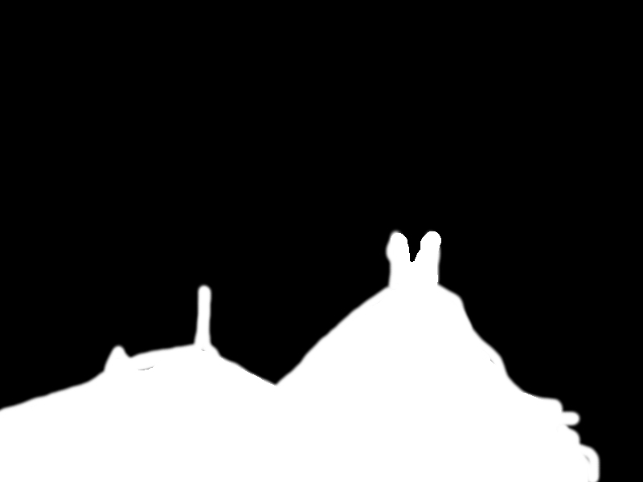 | 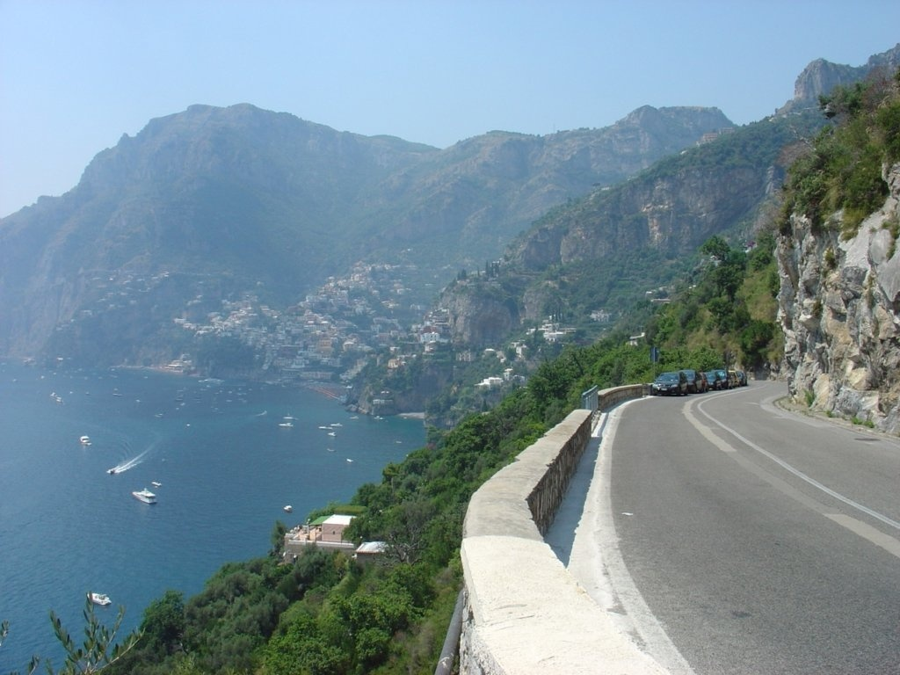 | 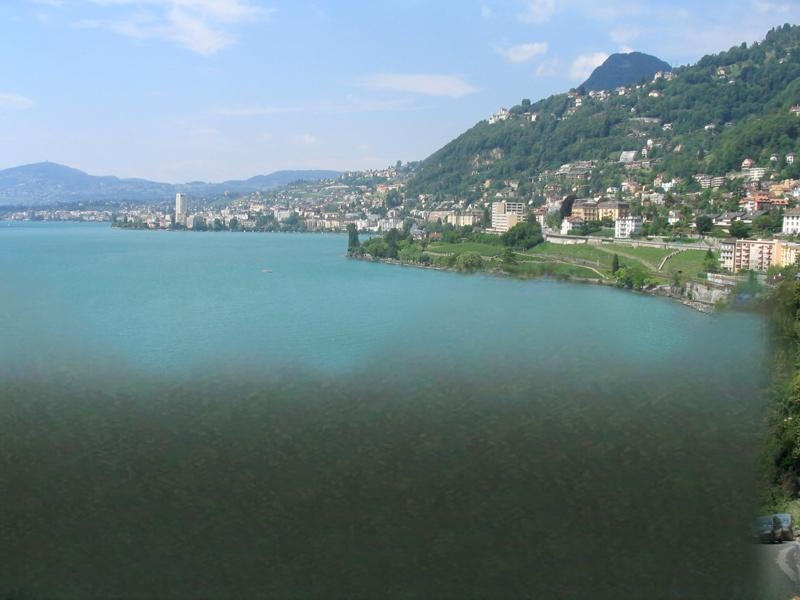 |
|  | 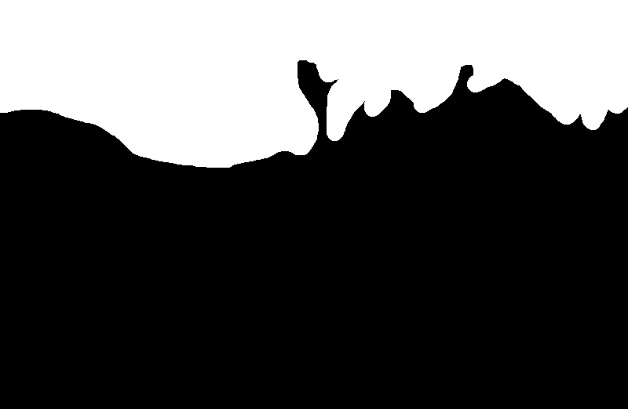 | 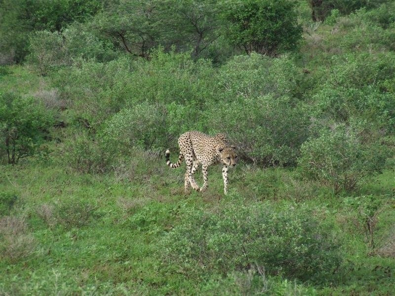 | 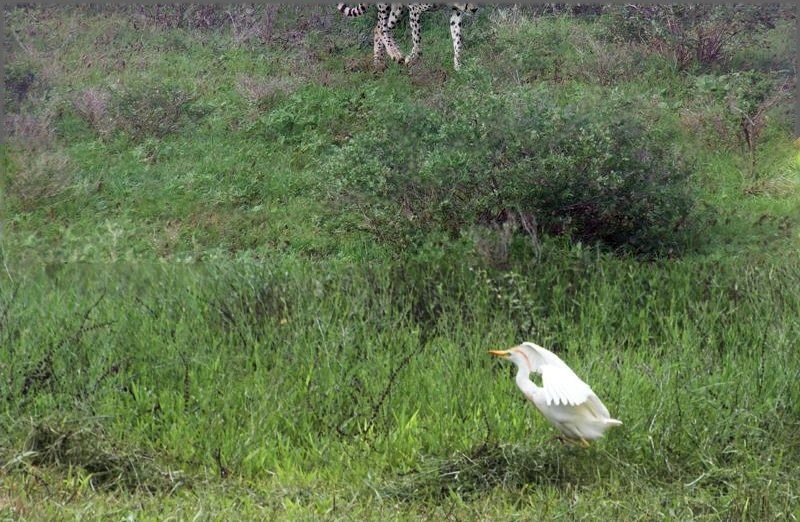 |
|  | 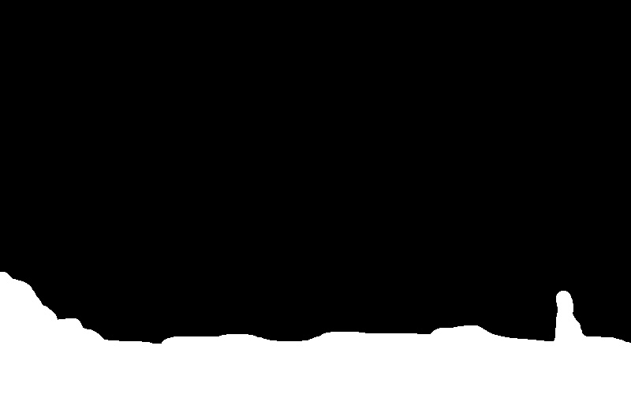 | 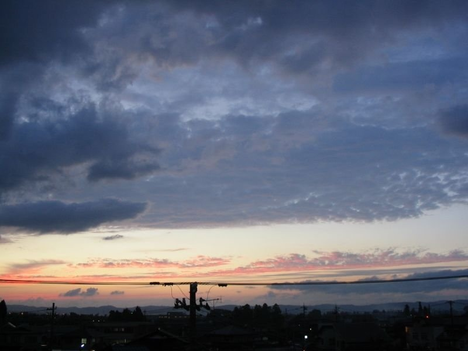 | 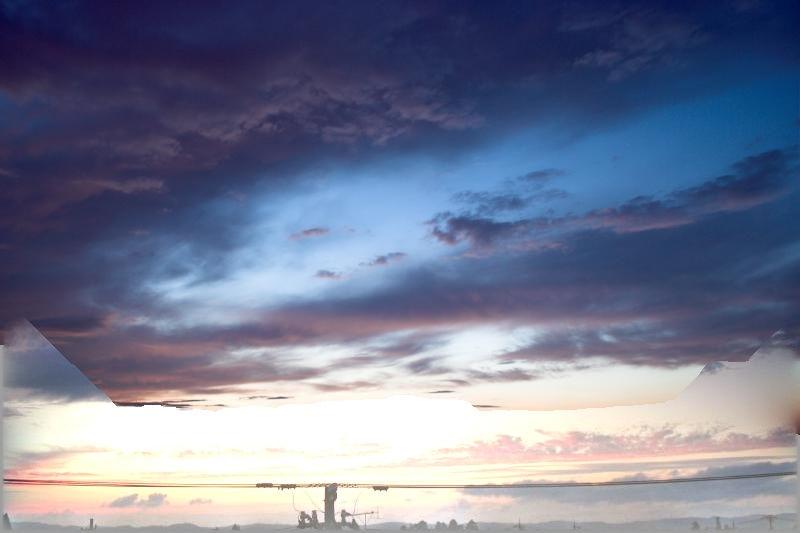 |
|  | 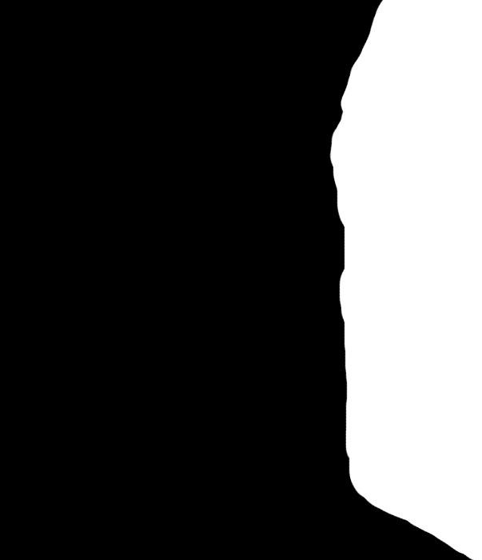 | 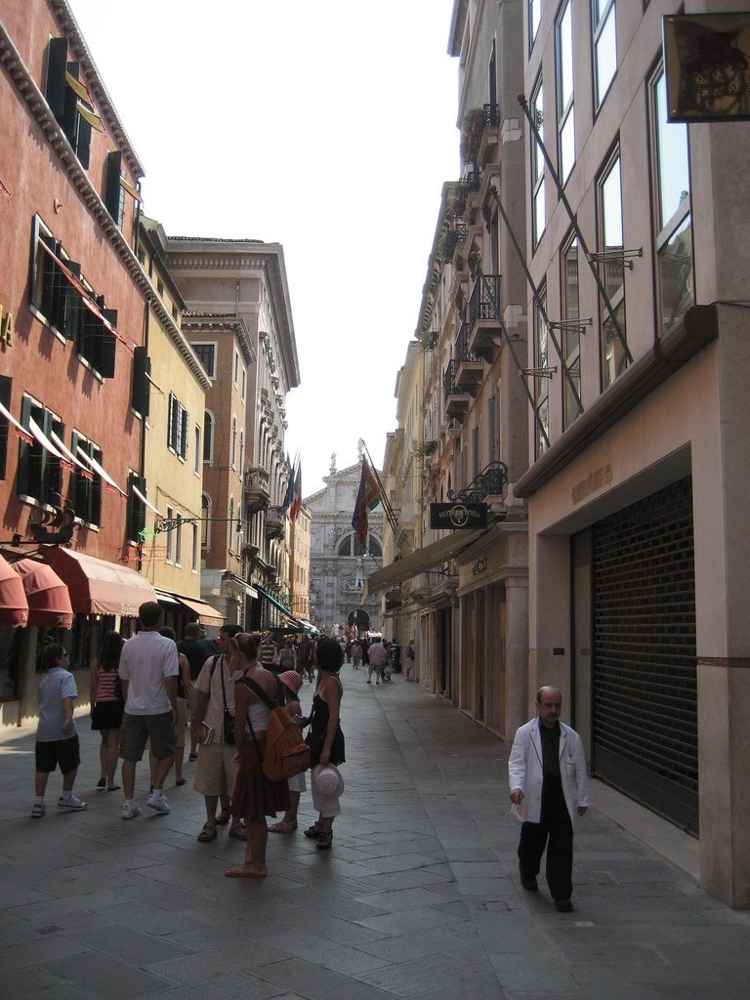 | 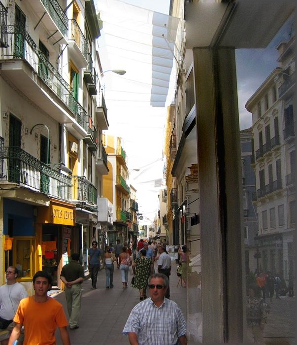 |

### Intermediate stages for `input3`

Between matching and blending, a graph-cut seam is traced around the hole and the
enclosed region is replaced:

| Seam mask (white = replaced) | Pasted composite | Final output (after LaMa cleanup) |
| --- | --- | --- |
| 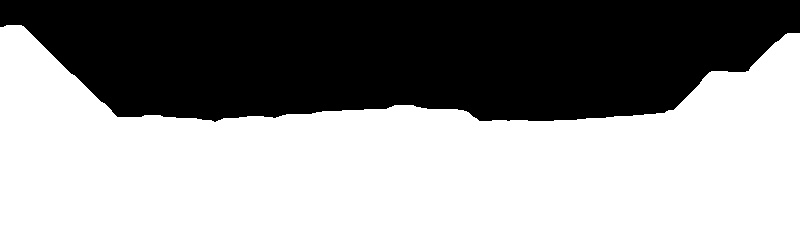 | 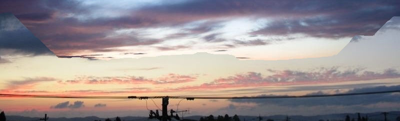 |  |

Finally, the LaMa pass re-synthesises the paste boundaries — shown below as
raw composite → seam band handed to the network → cleaned output:

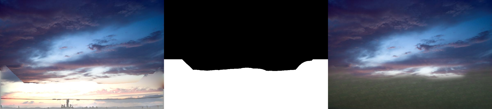

## Getting started

The project is managed with [uv](https://docs.astral.sh/uv/).

```bash
# install uv if you don't have it
curl -LsSf https://astral.sh/uv/install.sh | sh

uv sync --group dev        # creates .venv and installs all dependencies
```

Dependencies include `opencv-python-headless` (OpenCV >= 5), NumPy, scikit-image
and matplotlib.

### Run scene completion

```bash
# pick the best candidate from a directory automatically
uv run python local_context_matching.py \
    --image sample_images/images/input3.jpg \
    --mask sample_images/images/input3_mask.jpg \
    --candidates-dir sample_images/images/input3 \
    --save-dir output

# ...or specify the candidate image yourself
uv run python local_context_matching.py \
    --image sample_images/images/input3.jpg \
    --mask sample_images/images/input3_mask.jpg \
    --match sample_images/images/input3/result_img001.jpg \
    --save-dir output
```

Every intermediate stage (context windows, best match, seam mask, composites,
final output) is written to `--save-dir`. The last stage written,
`output_lama.jpg`, is the final output after the LaMa seam cleanup pass.
Pass `--no-lama` to skip it entirely, `--lama-ring` to only repaint a ring
around each paste boundary instead of the whole filled region, `--lama-band N`
to change the minimum margin (default 12), or `--lama-band-scale F` to change
how the margin grows with hole size (default 0.25, capped at 64 px).

### LaMa seam inpainting

The composited result inevitably shows a visible transition where the matched
content is pasted over the original photo. [`lama_inpaint.py`](lama_inpaint.py)
removes these artefacts with [LaMa](https://github.com/advimman/lama) running
through OpenCV's DNN module:

1. a **solid region mask** is built from the seam cut — the entire replaced
   area (hole + seams), grown outward by an adaptive margin of
   `max(12 px, min(64 px, 0.25 × hole side))`, so LaMa re-synthesises the
   whole fill rather than just harmonising its edges,
2. a padded window around that region is resampled to the network's fixed
   512x512 input, inpainted in one pass, and resampled back at full resolution
   — much sharper than squashing the whole photograph to 512x512,
3. the result is feather-blended strictly inside the region mask, so pixels
   outside it remain bit-identical to the raw composite.

The weights live in [`models/lama.onnx`](models/lama.onnx) and are tracked with
[Git LFS](https://git-lfs.com/) — install it before cloning, otherwise you will
only fetch a pointer file instead of the ~90 MB model.

### Tests

```bash
uv run pytest              # fast unit tests
uv run pytest -m slow      # + full pipeline integration test
```

### Notebooks

```bash
uv run jupyter lab
```

* [`GistDescriptor/gist_descriptor_colour.ipynb`](GistDescriptor/gist_descriptor_colour.ipynb) —
  colour GIST descriptor: computed per BGR channel and concatenated
  (16 x 32 x 3 = 1536 values).

## How it works

`local_context_matching.py` contains the whole pipeline:

| Function | Purpose |
| --- | --- |
| `read_images` | load photograph, Otsu-thresholded mask and candidate image |
| `get_masked_scene` | crop the *local context* window around the hole and black out the hole |
| `find_scene` | masked SSD search over every alignment (`cv2.matchTemplate`); brute force reference kept in `find_scene_bruteforce` |
| `pick_best_candidate` | rank a folder of candidates by their best masked context SSD |
| `create_seam_cut` | four minimum-cost seams around the hole via `skimage.graph.MCP`, closed by flood fill |
| `composite_scene` | merge match into original via `paste`, feathered `alphablend`, or Poisson `seamlessclone` |
| `composite` | paste the completed context back into the full size image |
| `build_seam_band_mask` | ring or solid LaMa region derived from the pasted (match) area |
| `_adaptive_band_width` | region margin from hole size, clamped between min and cap |
| `inpaint_seams_lama` | re-synthesise the fill with LaMa and feather-blend it back |
| `local_context_match` / `scene_completion_pipeline` | run everything end to end |

`lama_inpaint.py` wraps the ONNX model itself: lazy single load of the network,
windowed 512x512 inference at arbitrary resolutions (`lama_inpaint`), plus a
standalone CLI (`uv run python lama_inpaint.py [image] [mask]`).

## Other notes and work

Additional outputs are located in the following albums:

* <http://imgur.com/a/I0q0n>
* <http://imgur.com/a/ZdWUS>
* <http://imgur.com/a/jEeXF>

Whilst my (failed) attempt at the GIST descriptor is based on the hints provided
on [Quora](https://www.quora.com/Computer-Vision/What-is-a-GIST-descriptor). The
GIST descriptor is used to perform similar image matching within the
[Scene Completion paper](http://graphics.cs.cmu.edu/projects/scene-completion/).
The colour variant looks at all the colours rather than the grayscale image only.

The sample images are based on the
[Scene Completion work assignment which was implemented in Matlab](http://cs.brown.edu/courses/cs129/results/final/zyp/).
